# 💳 FinTech Wallet — Carteira Digital com Microcrédito Instantâneo

> **Arquiteto Decisor — Fase 3 (Cloud & Microsserviços)**  
> Disciplina: Engenharia de Software | Ciclo 3

---

## 🧭 Visão Executiva

A **FinTech Wallet** é uma plataforma de carteira digital que combina funcionalidades essenciais de pagamento e transferência com um motor de **microcrédito instantâneo** baseado em análise de crédito automatizada.

O problema central que a solução resolve é a exclusão financeira de pessoas sem acesso a crédito bancário tradicional: através de análise comportamental e de histórico transacional em tempo real, o sistema é capaz de aprovar ou recusar microcrédito em segundos, sem burocracia.

**Estado atual — Fase 3 (Ciclo 3):**  
A arquitetura foi evoluída de um design orientado a microsserviços containerizados (Fase 2) para um modelo **Serverless na AWS**, com funções Lambda por domínio de negócio, API Gateway como ponto de entrada unificado, e comunicação assíncrona via Amazon SQS/EventBridge para operações não críticas. A persistência utiliza DynamoDB para operações transacionais de alta velocidade e Aurora Serverless para o motor de crédito, que exige garantias ACID completas.

**Requisitos Não Funcionais críticos:** Segurança (PCI DSS / BACEN), Consistência (ACID), Auditabilidade, Baixa Latência.

---

## 🏗️ Diagrama C4 — Nível 2: Containers

```mermaid
C4Container
    title FinTech Wallet — Diagrama de Containers (C4 Nível 2)

    Person(user, "Usuário Final", "Cliente da carteira digital via app mobile ou web")
    Person(analyst, "Analista de Risco", "Monitora fraudes e aprova limites de crédito manuais")

    System_Boundary(fintech, "FinTech Wallet Platform") {

        Container(apigw, "API Gateway (AWS)", "AWS API Gateway + Cognito Authorizer", "Ponto de entrada único. Autenticação JWT, rate limiting, WAF integrado.")

        Container(wallet_fn, "Wallet Service", "AWS Lambda (Node.js)", "Gerencia saldo, pagamentos P2P e transferências. Garantia de idempotência via chave de transação.")

        Container(credit_fn, "Credit Engine", "AWS Lambda (Python)", "Motor de análise e aprovação de microcrédito. Executa scoring automatizado e chama bureau externo.")

        Container(auth_fn, "Auth Service", "AWS Lambda (Node.js) + Amazon Cognito", "Autenticação multifator (MFA), emissão de tokens JWT e gerenciamento de sessões.")

        Container(audit_fn, "Audit Service", "AWS Lambda (Node.js)", "Consome eventos de todas as operações e persiste trilha de auditoria imutável.")

        Container(notification_fn, "Notification Service", "AWS Lambda (Node.js)", "Envia notificações push, SMS e e-mail assincronamente.")

        ContainerDb(dynamo, "Wallet DB", "Amazon DynamoDB", "Armazena saldos, transações e histórico de pagamentos. Consistência forte por padrão.")

        ContainerDb(aurora, "Credit DB", "Amazon Aurora Serverless (PostgreSQL)", "Armazena contratos de crédito, parcelas e scoring. Exige ACID completo.")

        ContainerDb(audit_db, "Audit Store", "Amazon DynamoDB (append-only)", "Tabela imutável de eventos de auditoria. Write-once, read-many.")

        Container(event_bus, "Event Bus", "Amazon EventBridge + SQS", "Barramento de eventos para operações assíncronas: notificações, auditoria, relatórios.")

        Container(secrets, "Secrets Manager", "AWS Secrets Manager + KMS", "Gerenciamento de chaves, certificados e credenciais. Rotação automática.")
    }

    System_Ext(bureau, "Bureau de Crédito", "Serasa / SPC — consulta score externo")
    System_Ext(pix, "Bacen PIX API", "Infraestrutura do Banco Central para transferências instantâneas")
    System_Ext(fraud, "Motor Antifraude", "Serviço externo de detecção de fraudes em tempo real")

    Rel(user, apigw, "HTTPS/REST", "TLS 1.3")
    Rel(analyst, apigw, "HTTPS/REST", "TLS 1.3 + MFA")

    Rel(apigw, auth_fn, "Invoke", "JWT validation")
    Rel(apigw, wallet_fn, "Invoke", "Lambda Proxy")
    Rel(apigw, credit_fn, "Invoke", "Lambda Proxy")

    Rel(wallet_fn, dynamo, "Read/Write", "AWS SDK")
    Rel(wallet_fn, event_bus, "Publish", "EventBridge PutEvents")
    Rel(wallet_fn, pix, "HTTPS", "REST/mTLS")
    Rel(wallet_fn, fraud, "HTTPS", "REST síncrono")

    Rel(credit_fn, aurora, "Read/Write", "JDBC/SSL")
    Rel(credit_fn, bureau, "HTTPS", "REST/mTLS")
    Rel(credit_fn, event_bus, "Publish", "EventBridge PutEvents")

    Rel(event_bus, audit_fn, "Subscribe", "SQS FIFO")
    Rel(event_bus, notification_fn, "Subscribe", "SQS Standard")

    Rel(audit_fn, audit_db, "Write", "append-only")

    Rel(wallet_fn, secrets, "Read", "AWS SDK")
    Rel(credit_fn, secrets, "Read", "AWS SDK")
```



---

## 📄 Architecture Decision Records (ADRs)

| # | Decisão | Status |
|---|---------|--------|
| [ADR-0001](./docs/adrs/0001-estrategia-nuvem.md) | Estratégia de Nuvem e Escalabilidade — AWS Serverless (Lambda + API Gateway) | ✅ Aceito |
| [ADR-0002](./docs/adrs/0002-padrao-resiliencia.md) | Padrões de Resiliência — API Gateway + Circuit Breaker + Idempotência | ✅ Aceito |
| [ADR-0003](./docs/adrs/0003-modelo-comunicacao.md) | Modelo de Comunicação — Síncrono para transações, Assíncrono para eventos | ✅ Aceito |

---

## 📁 Estrutura do Repositório

```
fintech-wallet/
├── src/                          # Código-fonte dos serviços Lambda
│   ├── wallet-service/
│   ├── credit-engine/
│   ├── auth-service/
│   ├── audit-service/
│   └── notification-service/
├── docs/
│   ├── adrs/                     # Architecture Decision Records
│   │   ├── 0001-estrategia-nuvem.md
│   │   ├── 0002-padrao-resiliencia.md
│   │   └── 0003-modelo-comunicacao.md
│   ├── sad/
│   │   └── sad-fase3.md          # Software Architecture Document
│   └── diagrams/                 # Diagramas auxiliares
├── gold-plating/                 # Entregas extras (bônus)
├── README.md
└── .gitignore
```

---

## 🚀 Como Executar o Projeto Localmente

### Pré-requisitos

- [Node.js 20+](https://nodejs.org/)
- [Python 3.11+](https://python.org/)
- [AWS CLI v2](https://aws.amazon.com/cli/) configurado
- [AWS SAM CLI](https://docs.aws.amazon.com/serverless-application-model/latest/developerguide/install-sam-cli.html)
- [Docker](https://www.docker.com/) (para emulação local das Lambdas)

### 1. Clone o repositório

```bash
git clone https://github.com/seu-usuario/fintech-wallet.git
cd fintech-wallet
```

### 2. Configure variáveis de ambiente

```bash
cp .env.example .env
# Edite .env com suas credenciais de desenvolvimento
```

### 3. Instale dependências por serviço

```bash
cd src/wallet-service && npm install
cd ../credit-engine && pip install -r requirements.txt
cd ../auth-service && npm install
```

### 4. Execute localmente com AWS SAM

```bash
# Na raiz do projeto
sam local start-api --port 3000
```

O API Gateway local estará disponível em `http://localhost:3000`.

### 5. Execute os testes

```bash
# Testes unitários (wallet-service)
cd src/wallet-service && npm test

# Testes unitários (credit-engine)
cd src/credit-engine && pytest
```

---

## 👥 Equipe

| Nome | Matrícula |
|------|-----------|
| [Nome 1] | [Matrícula] |
| [Nome 2] | [Matrícula] |
| [Nome 3] | [Matrícula] |

---

## 📚 Referências

- Pressman, R. S. (2021). *Engenharia de Software: Uma Abordagem Profissional*. McGraw Hill.
- Richards, M., & Ford, N. (2020). *Fundamentals of Software Architecture*. O'Reilly Media.
- Newman, S. (2019). *Building Microservices*. O'Reilly Media.
- [C4 Model](https://c4model.com/) | [ADR GitHub](https://adr.github.io/)
