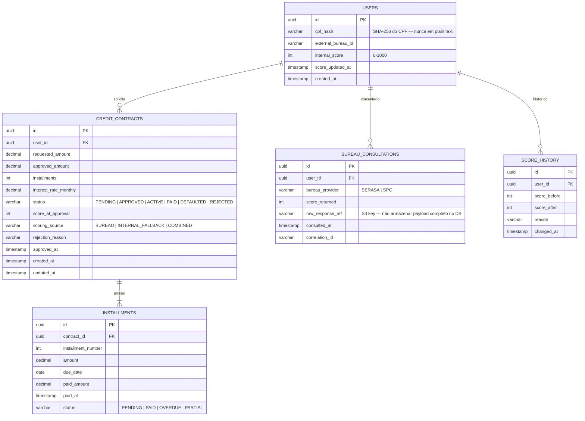

# Diagrama de Modelo de Dados
## FinTech Wallet — DynamoDB (Single-Table Design) + Aurora PostgreSQL

---

## 1. DynamoDB — Wallet Table (Single-Table Design)

O design de tabela única (single-table) segue a metodologia de Rick Houlihan (AWS) e Alex DeBrie (*The DynamoDB Book*), otimizando para acesso por padrões de consulta definidos, eliminando JOINs e garantindo latência sub-milissegundo.

### Estrutura da Tabela

```
Table: fintech-wallet
Partition Key (PK): String
Sort Key (SK): String
Billing: On-Demand
Encryption: KMS CMK (wallet-key)
Point-in-Time Recovery: Enabled
TTL Attribute: ttl (para idempotency records)
```

### Padrões de Acesso e Design de Chaves

```
┌─────────────────────────────┬──────────────────────────────────────┬──────────────────────────────────────────────┐
│ Entidade                    │ PK                                   │ SK                                           │
├─────────────────────────────┼──────────────────────────────────────┼──────────────────────────────────────────────┤
│ Perfil do Usuário           │ USER#{userId}                        │ PROFILE                                      │
│ Saldo do Usuário            │ USER#{userId}                        │ BALANCE                                      │
│ Transação                   │ USER#{userId}                        │ TXN#{timestamp_ms}#{txnId}                   │
│ Transação (lado receptor)   │ USER#{toUserId}                      │ TXN#{timestamp_ms}#{txnId}                   │
│ Chave de Idempotência       │ IDEMPOTENCY#{idempotencyKey}         │ META                                         │
│ Sessão de Usuário           │ SESSION#{sessionId}                  │ META                                         │
└─────────────────────────────┴──────────────────────────────────────┴──────────────────────────────────────────────┘
```

### Atributos por Entidade

**BALANCE (saldo)**
```json
{
  "PK": "USER#u-123",
  "SK": "BALANCE",
  "balance": 1500.00,
  "currency": "BRL",
  "updatedAt": "2025-06-10T14:30:00Z",
  "version": 42
}
```

**TXN (transação)**
```json
{
  "PK": "USER#u-123",
  "SK": "TXN#1718027400000#txn-abc",
  "txnId": "txn-abc",
  "type": "P2P_DEBIT | P2P_CREDIT | PIX_DEBIT | PIX_CREDIT",
  "amount": 200.00,
  "currency": "BRL",
  "counterpartyId": "u-456",
  "status": "COMPLETED | PENDING | FAILED",
  "idempotencyKey": "idem-xyz",
  "fraudCheckStatus": "PASSED | PENDING | SKIPPED_FALLBACK",
  "correlationId": "corr-789",
  "createdAt": "2025-06-10T14:30:00Z"
}
```

**IDEMPOTENCY (controle de duplicatas)**
```json
{
  "PK": "IDEMPOTENCY#idem-xyz",
  "SK": "META",
  "status": "COMPLETED",
  "responsePayload": "{...}",
  "createdAt": "2025-06-10T14:30:00Z",
  "ttl": 1718113800
}
```

### Global Secondary Indexes (GSIs)

```
GSI-1: TransactionsByDate
  PK: status (COMPLETED | PENDING | FAILED)
  SK: createdAt
  Use case: relatórios e dashboards operacionais

GSI-2: TransactionsByCorrelation
  PK: correlationId
  SK: createdAt
  Use case: rastreamento distribuído e debugging
```

---

## 2. DynamoDB — Audit Table (Append-Only)

```
Table: fintech-audit
Partition Key: eventId (UUID v4)
Sort Key: timestamp (ISO 8601)
Billing: On-Demand
Encryption: KMS CMK (audit-key) — chave separada da wallet-key
Point-in-Time Recovery: Enabled (retido 5 anos via S3 export)
IAM Policy: sem permissão de DeleteItem ou UpdateItem para qualquer role
```

**Estrutura de evento de auditoria**
```json
{
  "eventId": "evt-uuid-v4",
  "timestamp": "2025-06-10T14:30:00.123Z",
  "eventType": "PAYMENT_COMPLETED | CREDIT_APPROVED | LOGIN_SUCCESS | LOGIN_FAILED | ...",
  "actorId": "u-123",
  "targetId": "u-456",
  "resourceType": "TRANSACTION | CONTRACT | SESSION",
  "resourceId": "txn-abc",
  "payload": {
    "amount": 200.00,
    "status": "COMPLETED"
  },
  "ipAddress": "189.x.x.x",
  "deviceId": "dev-xyz",
  "correlationId": "corr-789",
  "serviceVersion": "wallet-service@1.4.2"
}
```

---

## 3. Aurora PostgreSQL Serverless v2 — Credit Schema



### Índices Aurora

```sql
-- Busca de contratos ativos por usuário (mais comum)
CREATE INDEX idx_contracts_user_status 
  ON credit_contracts(user_id, status) 
  WHERE status IN ('ACTIVE', 'PENDING');

-- Parcelas vencidas (job de cobrança)
CREATE INDEX idx_installments_overdue 
  ON installments(due_date, status) 
  WHERE status = 'PENDING';

-- Histórico de consultas ao bureau (auditoria regulatória)
CREATE INDEX idx_bureau_user_date 
  ON bureau_consultations(user_id, consulted_at DESC);
```

### Observações de Segurança

- **CPF**: nunca armazenado em plain text — hash SHA-256 com salt + referência ao Secrets Manager para o salt
- **Payload do bureau**: apenas metadados no DB; resposta completa em S3 com Server-Side Encryption
- **RDS Proxy**: Lambdas conectam via RDS Proxy para pooling de conexões — Lambda não abre conexão direta ao Aurora
- **VPC**: Aurora em subnet privada isolada, sem acesso público, Security Group restrito ao Security Group das Lambdas autorizadas

---

## Referências de Design

- DeBrie, A. (2020). *The DynamoDB Book*. Independently published.
- Houlihan, R. (2019). *Amazon DynamoDB Deep Dive: Advanced Design Patterns*. AWS re:Invent DAT401.
- AWS Documentation: *Best Practices for DynamoDB* (2024).
- Kleppmann, M. (2017). *Designing Data-Intensive Applications*. O'Reilly Media. Cap. 3 (Storage and Retrieval).
