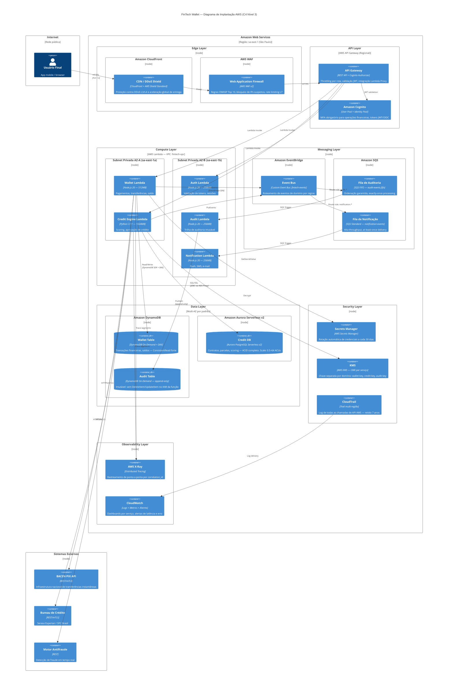

# Diagrama de Deployment — C4 Nível 3
## FinTech Wallet — Infraestrutura AWS

Este diagrama detalha a infraestrutura de implantação na AWS, complementando o Diagrama de Containers do README.

---

## Deployment Diagram (C4 Nível 3)

---

## Notas de Infraestrutura

### VPC e Isolamento de Rede

Todas as Lambdas operam dentro de uma **VPC dedicada** (`fintech-vpc`) com:
- Subnets privadas por AZ (sem acesso direto à internet)
- **NAT Gateway** para chamadas de saída (PIX, bureau, antifraude)
- **VPC Endpoints** para DynamoDB, SQS, Secrets Manager, KMS e EventBridge (tráfego não sai da rede AWS)
- Security Groups restritivos: cada Lambda tem acesso apenas aos recursos que precisa

### Alta Disponibilidade

| Componente | AZs | SLA AWS |
|------------|-----|---------|
| Lambda | Multi-AZ automático | 99,95% |
| DynamoDB | 3 AZs | 99,999% |
| Aurora Serverless v2 | Multi-AZ | 99,99% |
| SQS | Multi-AZ | 99,9% |
| API Gateway | Multi-AZ | 99,95% |

### Estimativa de Custo (baseline — 100k transações/mês)

| Serviço | Estimativa Mensal |
|---------|------------------|
| Lambda (Wallet + Credit) | ~$8 |
| API Gateway | ~$3,50 |
| DynamoDB On-Demand | ~$5 |
| Aurora Serverless v2 (0.5 ACU idle) | ~$12 |
| SQS + EventBridge | ~$1 |
| Secrets Manager + KMS | ~$3 |
| CloudWatch + X-Ray | ~$5 |
| **Total estimado** | **~$37,50/mês** |

> Custo escala linearmente com o volume. Para 1M transações/mês, estimativa ~$180/mês.
