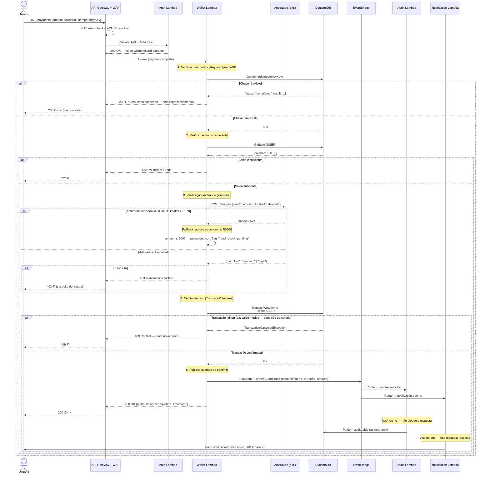
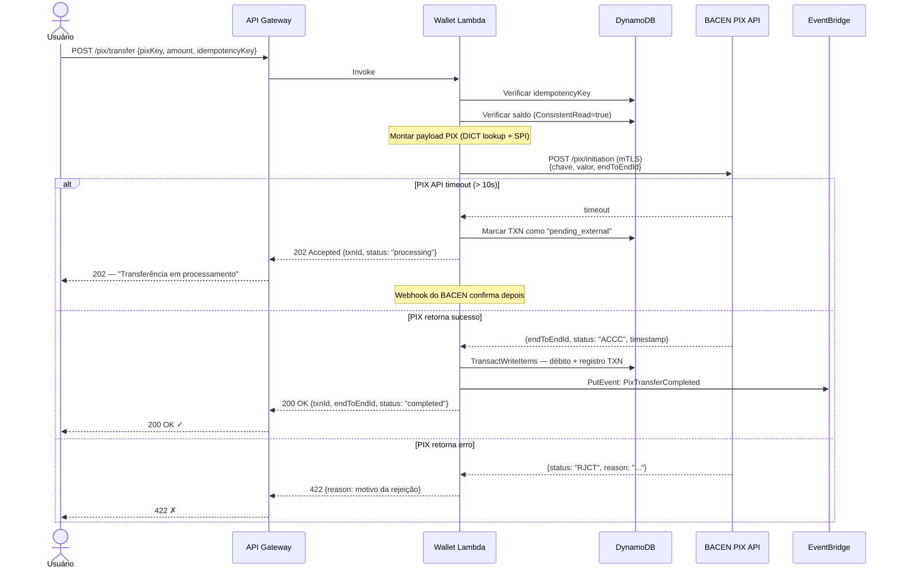
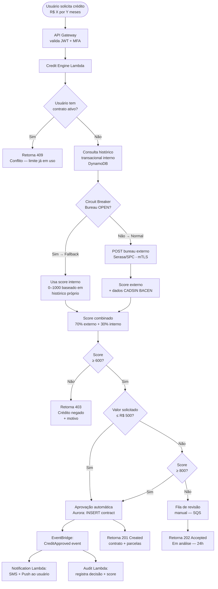
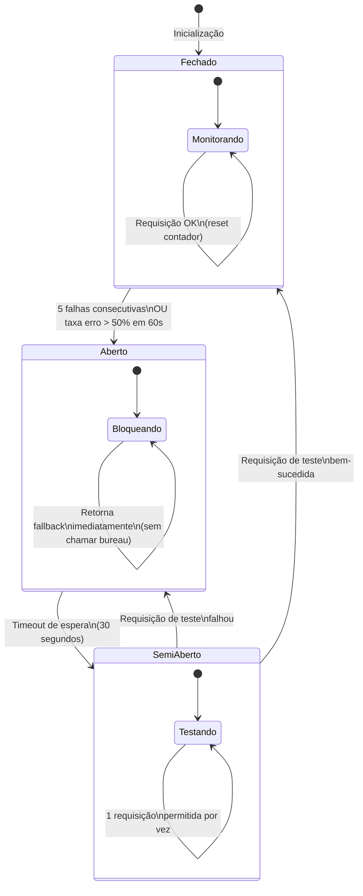

# Diagrama de Fluxo — Pagamento P2P e PIX
## FinTech Wallet

Este diagrama detalha o fluxo completo de uma transação financeira, desde a requisição do usuário até a confirmação final, incluindo os pontos de verificação de segurança, idempotência e resiliência.

---

## Fluxo de Pagamento P2P (Transferência entre usuários da plataforma)

---

## Fluxo de Transferência via PIX

---

## Fluxo de Aprovação de Microcrédito

---

## Estados do Circuit Breaker — Bureau de Crédito

