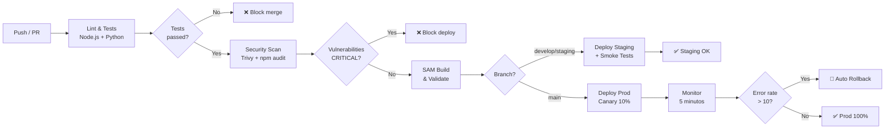

# Pipeline CI/CD — FinTech Wallet
## Gold Plating: Automação de Entrega Contínua

Este documento descreve a estratégia e configuração do pipeline de CI/CD adotado para a FinTech Wallet, utilizando **GitHub Actions** com deploy via **AWS SAM (Serverless Application Model)**.

---

## Visão Geral da Estratégia

O pipeline segue o modelo **GitFlow simplificado** com três ambientes:

```
feature/* → develop → staging → main (production)
    ↓           ↓         ↓          ↓
  lint/test   CI full   deploy    deploy
              + scan    staging   production
                        + smoke   + canary
```

### Princípios adotados

- **Shift-left security**: SAST e análise de dependências antes do deploy
- **Imutabilidade**: cada deploy gera uma versão Lambda versionada e alias imutável
- **Canary release**: produção recebe 10% do tráfego na nova versão, com rollback automático em caso de erro
- **Zero-downtime**: Lambda aliases garantem transição sem interrupção

---

## Arquivo de Pipeline — `.github/workflows/ci-cd.yml`

```yaml
name: FinTech Wallet CI/CD Pipeline

on:
  push:
    branches: [main, develop, staging]
  pull_request:
    branches: [main, develop]

env:
  AWS_REGION: sa-east-1
  SAM_TEMPLATE: template.yaml
  NODE_VERSION: "20"
  PYTHON_VERSION: "3.11"

jobs:
  # ─────────────────────────────────────────
  # JOB 1: Lint e Testes Unitários
  # ─────────────────────────────────────────
  test:
    name: Lint & Unit Tests
    runs-on: ubuntu-latest
    strategy:
      matrix:
        service: [wallet-service, auth-service, audit-service, notification-service]
    steps:
      - uses: actions/checkout@v4

      - name: Setup Node.js
        uses: actions/setup-node@v4
        with:
          node-version: ${{ env.NODE_VERSION }}
          cache: "npm"
          cache-dependency-path: src/${{ matrix.service }}/package-lock.json

      - name: Install dependencies
        working-directory: src/${{ matrix.service }}
        run: npm ci

      - name: Run ESLint
        working-directory: src/${{ matrix.service }}
        run: npm run lint

      - name: Run unit tests with coverage
        working-directory: src/${{ matrix.service }}
        run: npm run test:coverage

      - name: Upload coverage to Codecov
        uses: codecov/codecov-action@v4
        with:
          directory: src/${{ matrix.service }}/coverage
          flags: ${{ matrix.service }}

  test-credit-engine:
    name: Lint & Unit Tests — Credit Engine (Python)
    runs-on: ubuntu-latest
    steps:
      - uses: actions/checkout@v4

      - name: Setup Python
        uses: actions/setup-python@v5
        with:
          python-version: ${{ env.PYTHON_VERSION }}

      - name: Install dependencies
        working-directory: src/credit-engine
        run: |
          pip install -r requirements.txt
          pip install -r requirements-dev.txt

      - name: Run flake8 (lint)
        working-directory: src/credit-engine
        run: flake8 . --max-line-length=120

      - name: Run pytest with coverage
        working-directory: src/credit-engine
        run: pytest --cov=. --cov-report=xml --cov-fail-under=80

  # ─────────────────────────────────────────
  # JOB 2: Security Scan (SAST + Dependencies)
  # ─────────────────────────────────────────
  security:
    name: Security Scan
    runs-on: ubuntu-latest
    needs: [test, test-credit-engine]
    steps:
      - uses: actions/checkout@v4

      - name: Run Trivy — filesystem vulnerability scan
        uses: aquasecurity/trivy-action@master
        with:
          scan-type: fs
          scan-ref: .
          severity: HIGH,CRITICAL
          exit-code: 1
          format: sarif
          output: trivy-results.sarif

      - name: Upload Trivy results to GitHub Security
        uses: github/codeql-action/upload-sarif@v3
        with:
          sarif_file: trivy-results.sarif

      - name: Audit npm dependencies
        run: |
          for dir in src/wallet-service src/auth-service src/audit-service src/notification-service; do
            echo "Auditing $dir..."
            cd $dir && npm audit --audit-level=high && cd -
          done

      - name: Check Python dependencies (Safety)
        working-directory: src/credit-engine
        run: |
          pip install safety
          safety check -r requirements.txt

  # ─────────────────────────────────────────
  # JOB 3: Build e Validação SAM
  # ─────────────────────────────────────────
  build:
    name: SAM Build & Validate
    runs-on: ubuntu-latest
    needs: [security]
    steps:
      - uses: actions/checkout@v4

      - name: Setup AWS SAM CLI
        uses: aws-actions/setup-sam@v2
        with:
          use-installer: true

      - name: Configure AWS credentials (OIDC — sem secrets de longa duração)
        uses: aws-actions/configure-aws-credentials@v4
        with:
          role-to-assume: ${{ secrets.AWS_DEPLOY_ROLE_ARN }}
          aws-region: ${{ env.AWS_REGION }}

      - name: Validate SAM template
        run: sam validate --lint

      - name: SAM Build
        run: sam build --use-container --cached

      - name: Cache SAM build artifacts
        uses: actions/cache@v4
        with:
          path: .aws-sam
          key: sam-build-${{ github.sha }}

  # ─────────────────────────────────────────
  # JOB 4: Deploy para Staging
  # ─────────────────────────────────────────
  deploy-staging:
    name: Deploy → Staging
    runs-on: ubuntu-latest
    needs: [build]
    if: github.ref == 'refs/heads/develop' || github.ref == 'refs/heads/staging'
    environment:
      name: staging
      url: https://api-staging.fintech-wallet.com
    steps:
      - uses: actions/checkout@v4

      - name: Restore SAM build cache
        uses: actions/cache@v4
        with:
          path: .aws-sam
          key: sam-build-${{ github.sha }}

      - name: Configure AWS credentials
        uses: aws-actions/configure-aws-credentials@v4
        with:
          role-to-assume: ${{ secrets.AWS_DEPLOY_ROLE_ARN_STAGING }}
          aws-region: ${{ env.AWS_REGION }}

      - name: SAM Deploy — Staging
        run: |
          sam deploy \
            --stack-name fintech-wallet-staging \
            --s3-bucket ${{ secrets.SAM_ARTIFACTS_BUCKET_STAGING }} \
            --parameter-overrides \
              Environment=staging \
              LogLevel=DEBUG \
            --capabilities CAPABILITY_IAM CAPABILITY_AUTO_EXPAND \
            --no-confirm-changeset \
            --no-fail-on-empty-changeset

      - name: Run smoke tests
        run: |
          API_URL=$(aws cloudformation describe-stacks \
            --stack-name fintech-wallet-staging \
            --query "Stacks[0].Outputs[?OutputKey=='ApiUrl'].OutputValue" \
            --output text)
          
          # Health check
          curl -f "$API_URL/health" || exit 1
          
          # Auth endpoint disponível
          STATUS=$(curl -s -o /dev/null -w "%{http_code}" \
            -X POST "$API_URL/auth/login" \
            -H "Content-Type: application/json" \
            -d '{}')
          [ "$STATUS" = "400" ] || exit 1
          
          echo "Smoke tests passed ✓"

  # ─────────────────────────────────────────
  # JOB 5: Deploy para Produção (Canary)
  # ─────────────────────────────────────────
  deploy-production:
    name: Deploy → Production (Canary 10%)
    runs-on: ubuntu-latest
    needs: [deploy-staging]
    if: github.ref == 'refs/heads/main'
    environment:
      name: production
      url: https://api.fintech-wallet.com
    steps:
      - uses: actions/checkout@v4

      - name: Restore SAM build cache
        uses: actions/cache@v4
        with:
          path: .aws-sam
          key: sam-build-${{ github.sha }}

      - name: Configure AWS credentials
        uses: aws-actions/configure-aws-credentials@v4
        with:
          role-to-assume: ${{ secrets.AWS_DEPLOY_ROLE_ARN_PROD }}
          aws-region: ${{ env.AWS_REGION }}

      - name: SAM Deploy — Production (Canary)
        run: |
          sam deploy \
            --stack-name fintech-wallet-production \
            --s3-bucket ${{ secrets.SAM_ARTIFACTS_BUCKET_PROD }} \
            --parameter-overrides \
              Environment=production \
              LogLevel=INFO \
              DeploymentPreference=Canary10Percent5Minutes \
            --capabilities CAPABILITY_IAM CAPABILITY_AUTO_EXPAND \
            --no-confirm-changeset \
            --no-fail-on-empty-changeset

      - name: Monitor canary (5 minutos)
        run: |
          echo "Monitorando métricas do canary por 5 minutos..."
          sleep 300
          
          # Verificar taxa de erro no CloudWatch
          ERROR_RATE=$(aws cloudwatch get-metric-statistics \
            --namespace AWS/Lambda \
            --metric-name Errors \
            --dimensions Name=FunctionName,Value=fintech-wallet-production-WalletFunction \
            --start-time $(date -u -d '5 minutes ago' +%Y-%m-%dT%H:%M:%SZ) \
            --end-time $(date -u +%Y-%m-%dT%H:%M:%SZ) \
            --period 300 \
            --statistics Sum \
            --query 'Datapoints[0].Sum' \
            --output text)
          
          if (( $(echo "$ERROR_RATE > 10" | bc -l) )); then
            echo "Taxa de erro elevada ($ERROR_RATE erros). Rollback automático!"
            # CodeDeploy faz rollback automático via alarme configurado no SAM template
            exit 1
          fi
          
          echo "Canary estável ✓ — deploy completo em produção"

  # ─────────────────────────────────────────
  # JOB 6: Notificação de Resultado
  # ─────────────────────────────────────────
  notify:
    name: Notify Deploy Result
    runs-on: ubuntu-latest
    needs: [deploy-production]
    if: always()
    steps:
      - name: Notify Slack
        uses: slackapi/slack-github-action@v1
        with:
          payload: |
            {
              "text": "${{ needs.deploy-production.result == 'success' && '✅' || '❌' }} Deploy *fintech-wallet* para produção: ${{ needs.deploy-production.result }}\nCommit: ${{ github.sha }}\nAutor: ${{ github.actor }}"
            }
        env:
          SLACK_WEBHOOK_URL: ${{ secrets.SLACK_WEBHOOK_URL }}
```

---

## SAM Template Resumido — `template.yaml`

```yaml
AWSTemplateFormatVersion: '2010-09-09'
Transform: AWS::Serverless-2016-10-31

Parameters:
  Environment:
    Type: String
    AllowedValues: [staging, production]
  DeploymentPreference:
    Type: String
    Default: AllAtOnce

Globals:
  Function:
    Runtime: nodejs20.x
    Architectures: [arm64]       # Graviton2 — 20% mais barato
    Environment:
      Variables:
        ENVIRONMENT: !Ref Environment
        POWERTOOLS_SERVICE_NAME: fintech-wallet
    Tracing: Active              # AWS X-Ray
    Layers:
      - !Sub arn:aws:lambda:${AWS::Region}:017000801446:layer:AWSLambdaPowertoolsTypeScriptV2:latest

Resources:
  WalletFunction:
    Type: AWS::Serverless::Function
    Properties:
      CodeUri: src/wallet-service/
      Handler: handler.main
      MemorySize: 512
      Timeout: 29
      ReservedConcurrentExecutions: 100
      AutoPublishAlias: live
      DeploymentPreference:
        Type: !Ref DeploymentPreference
        Alarms:
          - !Ref WalletErrorAlarm
      Policies:
        - DynamoDBCrudPolicy:
            TableName: !Ref WalletTable
        - EventBridgePutEventsPolicy:
            EventBusName: fintech-events
      Events:
        ApiPayment:
          Type: Api
          Properties:
            Path: /payments
            Method: post
            RestApiId: !Ref FinTechApi

  WalletErrorAlarm:
    Type: AWS::CloudWatch::Alarm
    Properties:
      AlarmName: !Sub fintech-wallet-errors-${Environment}
      MetricName: Errors
      Namespace: AWS/Lambda
      Threshold: 10
      EvaluationPeriods: 2
      Period: 60
      ComparisonOperator: GreaterThanThreshold
      TreatMissingData: notBreaching
```

---

## Fluxo Visual do Pipeline



---

## Referências

- Kim, G. et al. (2016). *The DevOps Handbook*. IT Revolution Press.
- AWS Documentation: *Deploying serverless applications gradually* (CodeDeploy + Lambda aliases).
- GitHub Docs: *Using OpenID Connect with AWS* (OIDC — sem secrets de longa duração).
